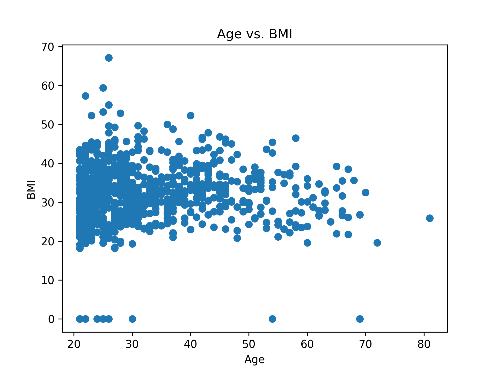

# IDS706-Polars-Descriptive-YuhanXue

This is a Python script for the IDS706 Mini Project 2. The script reads a CSV dataset, calculates descriptive statistics, and generates a scatter plot visualization.

## Getting Started
Before running the script, please install all dependecies:
```
pip install -r requirements.txt
```
Some new dependencies:
1. Pandas
2. Matplotlib

## Running Scripts
Use the following command to run the script:
```
python main.py
```
This script prints the descriptive statistics (i.e. mean, median, standard deviation) for each columns in the `diabetes.csv`. The output of this script is shown in [Data Report](#data-report). In addition, the scatter plot it generates is shown in [Visualization](#visualization).


## Data Sample
| Pregnancies | Glucose | BloodPressure | SkinThickness | Insulin | BMI | DiabetesPedigreeFunction | Age | Outcome |
| ----------- | ------- | ------------- | ------------- | ------- | --- | ------------------------ | --- | ------- |
| 6           | 148     | 72            | 35            | 0       | 33.6| 0.627                    | 50  | 1       |
| 1           | 85      | 66            | 29            | 0       | 26.6| 0.351                    | 31  | 0       |
| 8           | 183     | 64            | 0             | 0       | 23.3| 0.672                    | 32  | 1       |
| 1           | 89      | 66            | 23            | 94      | 28.1| 0.167                    | 21  | 0       |
| 0           | 137     | 40            | 35            | 168     | 43.1| 0.288                    | 33  | 1       |


## Data Report
============ Pregnancies ============ <br>
Mean: 3.8450520833333335 <br>
Median: 3.0 <br>
Std Dev: 3.3695780626988694 <br>
============ Glucose ============ <br>
Mean: 120.89453125 <br>
Median: 117.0 <br>
Std Dev: 31.97261819513622 <br>
============ BloodPressure ============ <br>
Mean: 69.10546875 <br>
Median: 72.0 <br>
Std Dev: 19.355807170644777 <br>
============ SkinThickness ============ <br>
Mean: 20.536458333333332 <br>
Median: 23.0 <br>
Std Dev: 15.952217567727637 <br>
============ Insulin ============ <br>
Mean: 79.79947916666667 <br>
Median: 30.5 <br>
Std Dev: 115.24400235133817 <br>
============ BMI ============ <br>
Mean: 31.992578124999998 <br>
Median: 32.0 <br>
Std Dev: 7.884160320375446 <br>
============ DiabetesPedigreeFunction ============ <br>
Mean: 0.47187630208333325 <br>
Median: 0.3725 <br>
Std Dev: 0.3313285950127749 <br>
============ Age ============ <br>
Mean: 33.240885416666664 <br>
Median: 29.0 <br>
Std Dev: 11.760231540678685 <br>
============ Outcome ============ <br>
Mean: 0.3489583333333333 <br>
Median: 0.0 <br>
Std Dev: 0.47695137724279896 <br>
\=================================


## Visualization
